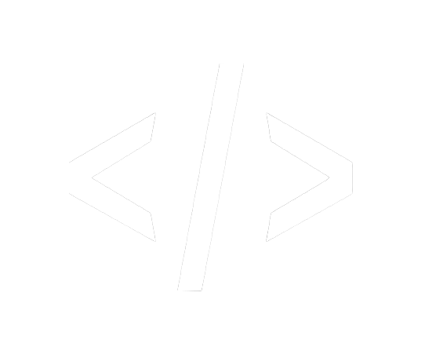

  

    
  

  
  
  
  
  

  [🌐 Site](https://aura-chatbot.vercel.app) | [📚 Documentação](#-documentação) | [🚀 Demo](#-demo) | [📋 Roadmap](#-roadmap)

  **Um chatbot inteligente com CRM integrado para revolucionar o atendimento ao cliente**

---

# 🤖 Aura Chat Bot

> **TCC - Aura Chat Bot** é uma solução completa desenvolvida para **transformar a Gestão do Atendimento ao Cliente** em pequenas e médias empresas. Com o crescimento exponencial das consultas digitais, nossa plataforma oferece respostas automáticas inteligentes, centralização de dados e identificação proativa de oportunidades de vendas.

## ✨ Principais Funcionalidades

🤖 **IA Conversacional Avançada** - Powered by Groq AI para respostas naturais e contextuais  
📱 **Interface Moderna** - Design responsivo inspirado no WhatsApp com tema claro/escuro  
🔗 **Multi-plataforma** - Integração nativa com WhatsApp, Telegram e Messenger  
📊 **Dashboard Analytics** - Métricas em tempo real e relatórios detalhados  
👥 **CRM Integrado** - Gestão completa de clientes e oportunidades  
🌍 **Multilíngue** - Suporte completo para Português e Inglês  
🎨 **Personalização Total** - 8+ temas de cores e configurações avançadas  
🔒 **Segurança Enterprise** - Autenticação robusta e proteção de dados  

---

## 🛠️ Stack Tecnológica

### Frontend
- **⚛️ Next.js 14** - Framework React com App Router
- **📘 TypeScript** - Tipagem estática para maior confiabilidade
- **🎨 Tailwind CSS** - Framework CSS utilitário
- **🧩 Shadcn/ui** - Componentes UI modernos e acessíveis
- **🎯 Lucide React** - Biblioteca de ícones vetoriais

### Backend
- **🐍 Python 3.9+** - Linguagem principal do backend
- **🌶️ Flask** - Framework web minimalista e flexível
- **🧠 Groq AI** - Processamento avançado de linguagem natural
- **📡 Server-Sent Events** - Comunicação em tempo real

### DevOps & Tools
- **🚀 Vercel** - Deploy e hospedagem na nuvem
- **🔧 Ngrok** - Túneis seguros para desenvolvimento
- **📦 npm/pip** - Gerenciamento de dependências
- **🔄 Git** - Controle de versão distribuído

---

## 🚀 Instalação Rápida

### Pré-requisitos
\`\`\`bash
# Verifique as versões instaladas
node --version    # v18.0.0+
python --version  # v3.9.0+
git --version     # v2.0.0+
\`\`\`

### 1️⃣ Clone e Configure
\`\`\`bash
# Clone o repositório
git clone https://github.com/unaspht/aura.git
cd aura

# Configure variáveis de ambiente
cp .env.example .env.local
# Edite .env.local com suas credenciais
\`\`\`

### 2️⃣ Backend Python
\`\`\`bash
# Crie ambiente virtual
python -m venv .venv

# Ative o ambiente virtual
# 🪟 Windows
.venv\Scripts\activate
# 🐧 Linux/macOS
source .venv/bin/activate

# Instale dependências
pip install -r requirements.txt
\`\`\`

### 3️⃣ Frontend Next.js
\`\`\`bash
# Instale dependências Node.js
npm install
# ou
yarn install
\`\`\`

### 4️⃣ Configuração de API Keys
\`\`\`env
# .env.local
GROQ_API_KEY=sua_groq_api_key_aqui
NEXT_PUBLIC_API_URL=http://localhost:3001
PORT=3001
FLASK_ENV=development
NGROK_AUTH_TOKEN=
\`\`\`

---

## ▶️ Executando o Projeto

### 🚀 Desenvolvimento Local

**Terminal 1 - Backend Flask:**
\`\`\`bash
# Na raiz do projeto
python -m src.aura.app
# 🌐 Backend rodando em http://localhost:3001
\`\`\`

**Terminal 2 - Frontend Next.js:**
\`\`\`bash
# Na raiz do projeto
npm run dev
# 🌐 Frontend rodando em http://localhost:3000
\`\`\`

### ⚡ Script de Desenvolvimento Rápido
\`\`\`bash
# Inicia backend e frontend simultaneamente
chmod +x start-dev.sh
./start-dev.sh
\`\`\`

### 🌐 Exposição Externa (Opcional)
\`\`\`bash
# Terminal 3 - Ngrok
ngrok http 3000
# Gera URL pública para testes
\`\`\`

---

## 📁 Arquitetura do Projeto

\`\`\`
aura/
├── 📁 app/                                # 🔥 Next.js App Router
│   ├── 📁 api/                           # API Routes
│   │   └── 📁 chat/
│   │       └── route.ts                   # Endpoint principal do chat
│   ├── 📁 panel/                         # 🎛️ Painel Administrativo
│   │   ├── 📁 access-levels/             # Gestão de permissões
│   │   ├── 📁 chat/                      # Interface de chat
│   │   ├── 📁 contas/                    # Gestão de contas
│   │   ├── 📁 settings/                  # Configurações
│   │   ├── loading.tsx                   # Loading states
│   │   └── page.tsx                      # Dashboard principal
│   ├── 📁 login/ & 📁 signup/            # Autenticação
│   ├── layout.tsx                        # Layout raiz
│   ├── page.tsx                          # Landing page
│   └── globals.css                       # Estilos globais
│
├── 📁 src/aura/                          # 🧠 Core da Aplicação
│   ├── 🐍 app.py                         # Servidor Flask principal
│   ├── ⚛️ App.tsx                        # Componente raiz React
│   │
│   ├── 📁 features/                      # 🎯 Funcionalidades Principais
│   │   ├── 📁 modules/                   # 🐍 Backend Python
│   │   │   ├── Chat.py                   # Sistema de chat e IA
│   │   │   └── Accounts.py               # Gestão de contas/integrações
│   │   │
│   │   └── 📁 view/                      # ⚛️ Frontend React
│   │       ├── 📁 auth/                  # 🔐 Sistema de Autenticação
│   │       │   ├── Login.tsx             # Página de login
│   │       │   └── SignUp.tsx            # Página de registro
│   │       │
│   │       ├── 📁 chat/                  # 💬 Interface de Chat
│   │       │   ├── types.ts              # Tipos TypeScript
│   │       │   ├── ChatHeader.tsx        # Cabeçalho do chat
│   │       │   ├── ChatSidebar.tsx       # Sidebar de conversas
│   │       │   ├── ChatMessages.tsx      # Área de mensagens
│   │       │   ├── ChatInput.tsx         # Input de mensagens
│   │       │   ├── ChatInfo.tsx          # Informações do contato
│   │       │   ├── ChatTemplate.tsx      # Template base
│   │       │   ├── ControlSidebar.tsx    # Controles avançados
│   │       │   ├── EmojiPicker.tsx       # Seletor de emojis
│   │       │   ├── ClientDataModal.tsx   # Modal de dados do cliente
│   │       │   ├── DetailsModal.tsx      # Modal de detalhes
│   │       │   ├── FinalizarModal.tsx    # Modal de finalização
│   │       │   ├── NewMessageModal.tsx   # Modal nova mensagem
│   │       │   └── ExitConfirmModal.tsx  # Confirmação de saída
│   │       │
│   │       ├── 📁 homePanels/            # 🏠 Painéis do Dashboard
│   │       │   ├── Header.tsx            # Cabeçalho dos painéis
│   │       │   ├── Sidebar.tsx           # Sidebar principal
│   │       │   ├── Content.tsx           # Conteúdo principal
│   │       │   ├── InfoCard.tsx          # Cards informativos
│   │       │   ├── ListCard.tsx          # Cards de lista
│   │       │   ├── Charts.tsx            # Gráficos e métricas
│   │       │   ├── Stats.tsx             # Estatísticas
│   │       │   ├── UserAccount.tsx       # Conta do usuário
│   │       │   ├── ColorPanel.tsx        # Painel de temas
│   │       │   ├── SearchPanel.tsx       # Painel de busca
│   │       │   ├── ChannelModal.tsx      # Modal de canais
│   │       │   └── ThemeContext.tsx      # Contexto de tema
│   │       │
│   │       ├── Chat.tsx                  # Página principal do chat
│   │       ├── Contas.tsx                # Gestão de contas
│   │       ├── Conversations.tsx         # Lista de conversas
│   │       ├── Home.tsx                  # Dashboard principal
│   │       ├── Panel.tsx                 # Layout do painel
│   │       ├── PanelContent.tsx          # Conteúdo do painel
│   │       └── Teste.tsx                 # Página de testes
│   │
│   ├── 📁 components/                    # 🧩 Componentes Reutilizáveis
│   │   ├── Header.tsx                    # Cabeçalho global
│   │   ├── Footer.tsx                    # Rodapé
│   │   ├── ThemeProvider.tsx             # Provedor de tema
│   │   ├── ThemeToggle.tsx               # Toggle de tema
│   │   ├── SettingsModal.tsx             # Modal de configurações
│   │   ├── AnimatedText.tsx              # Texto animado
│   │   ├── LogoCarousel.tsx              # Carrossel de logos
│   │   ├── NeuralNetworkAnimation.tsx    # Animação de rede neural
│   │   ├── WaveDotsBackground.tsx        # Background animado
│   │   ├── BackgroundAnimations.tsx      # Animações de fundo
│   │   └── TarsChat.tsx                  # Componente do chat TARS
│   │
│   ├── 📁 contexts/                      # 🔄 Contextos React
│   │   ├── AuthContext.tsx               # Contexto de autenticação
│   │   ├── LanguageContext.tsx           # Contexto de idioma
│   │   └── SettingsContext.tsx           # Contexto de configurações
│   │
│   ├── 📁 languages/                     # 🌍 Internacionalização
│   │   ├── index.ts                      # Exportações de idiomas
│   │   ├── pt-br.ts                      # Português brasileiro
│   │   └── en-us.ts                      # Inglês americano
│   │
│   └── 📁 styles/                        # 🎨 Estilos CSS
│       ├── App.css                       # Estilos principais
│       ├── index.css                     # Estilos base
│       └── panel.css                     # Estilos do painel
│
├── 📁 components/                        # 🧩 Componentes Next.js Globais
│   ├── 📁 ui/                           # Shadcn/ui components
│   │   ├── button.tsx                    # Botões
│   │   ├── card.tsx                      # Cards
│   │   ├── dropdown-menu.tsx             # Dropdown menus
│   │   ├── avatar.tsx                    # Avatars
│   │   └── ... (outros componentes ui)
│   ├── header.tsx                        # Cabeçalho Next.js
│   ├── footer.tsx                        # Rodapé Next.js
│   ├── theme-provider.tsx                # Provedor de tema Next.js
│   ├── testimonial-card.tsx              # Card de depoimento
│   ├── calendar-modal.tsx                # Modal de calendário
│   ├── matrix-rain.tsx                   # Efeito Matrix
│   ├── digital-mesh-background.tsx       # Background mesh
│   ├── geometric-background-3d.tsx       # Background 3D
│   ├── wave-dots-background.tsx          # Background ondas
│   ├── animated-text.tsx                 # Texto animado global
│   ├── tars-chat.tsx                     # Chat TARS global
│   ├── neural-network-animation.tsx      # Animação rede neural
│   ├── logo-carousel.tsx                 # Carrossel de logos
│   └── settings-modal.tsx                # Modal de configurações
│
├── 📁 contexts/                          # 🔄 Contextos Next.js
│   └── settings-context.tsx              # Contexto de configurações
│
├── 📁 hooks/                             # 🎣 Custom Hooks
│   ├── use-mobile.tsx                    # Hook para detectar mobile
│   └── use-toast.ts                      # Hook para toasts
│
├── 📁 lib/                               # 🛠️ Utilitários
│   └── utils.ts                          # Funções utilitárias (cn, etc)
│
├── 📁 public/                            # 📦 Assets Estáticos
│   ├── 📁 carrossel/                     # Logos do carrossel
│   │   ├── ERA.svg                       # Logo ERA
│   │   ├── Google.svg                    # Logo Google
│   │   ├── Microsoft.svg                 # Logo Microsoft
│   │   ├── Pirelli.svg                   # Logo Pirelli
│   │   └── ... (outros logos)
│   ├── 📁 redesociais/                   # Ícones de redes sociais
│   │   ├── whatsapp.svg                  # WhatsApp
│   │   ├── telegram.svg                  # Telegram
│   │   ├── messenger.svg                 # Messenger
│   │   └── ... (versões PNG)
│   ├── favicon.png                       # Ícone da aplicação
│   ├── neural-network.png                # Imagem da rede neural
│   ├── bot-icon.png                      # Ícone do bot
│   └── ... (outras imagens de referência)
│
├── 📄 Arquivos de Configuração
│   ├── .env.local                        # Variáveis de ambiente
│   ├── .gitignore                        # Arquivos ignorados pelo Git
│   ├── package.json                      # Dependências Node.js
│   ├── requirements.txt                  # Dependências Python
│   ├── tailwind.config.ts                # Configuração Tailwind CSS
│   ├── tsconfig.json                     # Configuração TypeScript
│   ├── next.config.mjs                   # Configuração Next.js
│   ├── middleware.ts                     # Middleware Next.js
│   └── start-dev.sh                      # Script de desenvolvimento
│
├── 📄 Arquivos Python de Inicialização
│   ├── __init__.py                       # Raiz Python
│   └── 📁 Estrutura completa de __init__.py em todos os módulos
│
├── 📄 home.tsx                           # Componente home alternativo
└── 📄 README.md                          # Esta documentação
\`\`\`